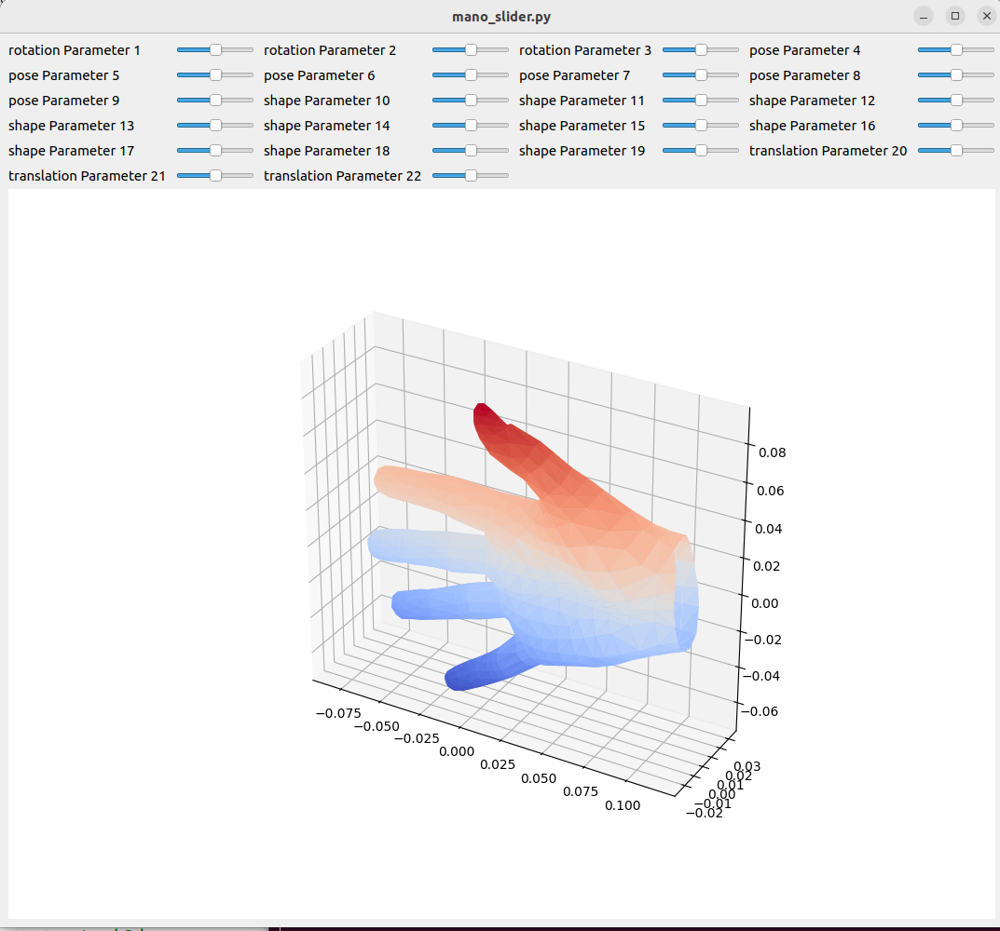

# ManoVisualizer

Allows you to visualize MANO parameters and their impact on the Mano Hand Model i.e. Mesh.

The visualizer provide a set of sliders that control the corrsponding mano parameters

The first 3 are for global rotation, the next Num_comps parameters which what you provide to the script are the MANO angles, the maximum value is 45 in which each slider control one degree of freedom of one hand joint while the minimum is 6 which are the PCA main components that control the abstract pose of the hand

You are also provided with 10 shape parameters and 3 translation parameters

You can easily run the script by python3 mano_slider.py 45.

Requirements are MANO and chumpy libraries and that MANO models are places in ../mano_v1_2/models

